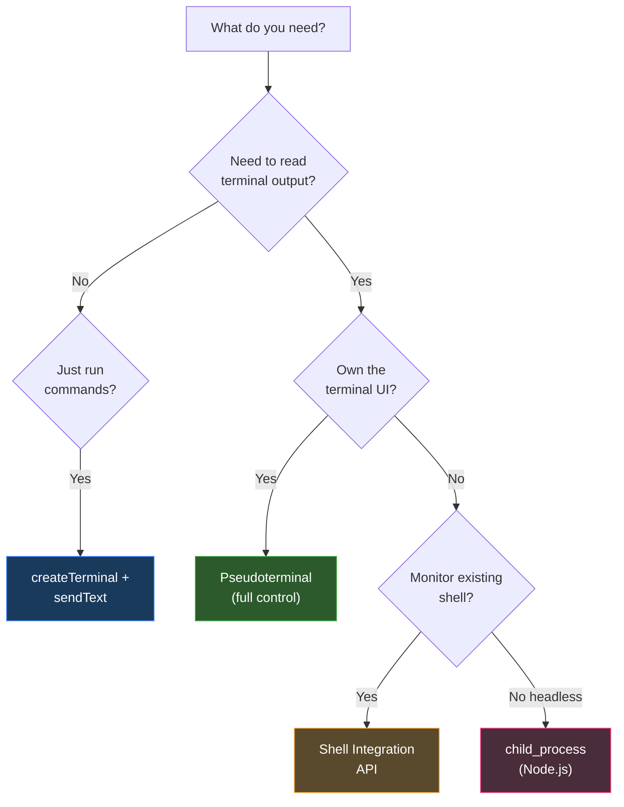

# VS Code Extension Terminal Control — Research

## Overview

VS Code exposes **4 distinct approaches** for extensions to interact with terminals, each with different levels of control:

| Approach | Control Level | Read Output? | Write Input? | Use Case |
|---|---|---|---|---|
| **Standard Terminal** (`createTerminal`) | Low | ❌ No | ✅ `sendText()` | Run one-off commands |
| **Pseudoterminal** (`Pseudoterminal` / `Pty`) | Full | ✅ Yes (you *are* the source) | ✅ Yes | Custom REPLs, agent UIs |
| **Shell Integration API** | Medium | ✅ Yes (stream) | ❌ No | Monitor existing shells |
| **`child_process`** (Node) | Full (but no UI) | ✅ stdout/stderr | ✅ stdin | Headless command execution |

---

## 1. Standard Terminal — `createTerminal` + `sendText`

The simplest approach. You create a terminal and send commands to it.

```typescript
// Create
const terminal = vscode.window.createTerminal('My Terminal');
terminal.show();

// Send command (auto-appends newline = execute)
terminal.sendText('echo "Hello World"');

// Send text WITHOUT executing (no trailing \n)
terminal.sendText('echo "Hello"', false);
```

### TerminalOptions

```typescript
const terminal = vscode.window.createTerminal({
  name: 'My Terminal',
  shellPath: '/bin/zsh',          // override default shell
  shellArgs: ['-l'],              // shell arguments
  cwd: '/path/to/working/dir',   // working directory
  env: { MY_VAR: 'value' },      // environment variables
  strictEnv: false,               // if true, only use `env` (no inherited env)
  hideFromUser: false,            // hidden terminal (background work)
  message: 'Welcome!',           // displayed on open
  iconPath: new vscode.ThemeIcon('terminal'),
  color: new vscode.ThemeColor('terminal.ansiGreen'),
});
```

### Terminal Properties

```typescript
terminal.name          // string — the terminal name
terminal.processId     // Thenable<number | undefined> — shell PID
terminal.creationOptions  // TerminalOptions | ExtensionTerminalOptions
terminal.exitStatus    // { code: number | undefined, reason: TerminalExitReason }
terminal.state         // { isInteractedWith: boolean }
```

### Terminal Methods

```typescript
terminal.sendText(text: string, shouldExecute?: boolean): void
terminal.show(preserveFocus?: boolean): void
terminal.hide(): void
terminal.dispose(): void   // kill the terminal
```

> [!WARNING]
> **You CANNOT read output** from a standard terminal. There is no stable public API like `onDidWriteTerminalData` for arbitrary terminals.

---

## 2. Pseudoterminal (`Pty`) — Full Control

This is the **most powerful** approach. Your extension becomes the terminal backend — you control both input and output.

```typescript
const writeEmitter = new vscode.EventEmitter<string>();
const closeEmitter = new vscode.EventEmitter<number | void>();

const pty: vscode.Pseudoterminal = {
  // REQUIRED: Event that fires to write data to the terminal UI
  onDidWrite: writeEmitter.event,

  // OPTIONAL: Event to signal the terminal should close
  onDidClose: closeEmitter.event,

  // OPTIONAL: Event to override the terminal name dynamically
  onDidChangeName?: Event<string>,

  // OPTIONAL: Event to override terminal dimensions
  onDidOverrideDimensions?: Event<TerminalDimensions | undefined>,

  // REQUIRED: Called when terminal is ready
  open(initialDimensions: TerminalDimensions | undefined): void {
    writeEmitter.fire('Welcome to my terminal!\r\n');
    writeEmitter.fire('$ ');
  },

  // REQUIRED: Called when terminal is closed by user
  close(): void {
    // cleanup resources
  },

  // OPTIONAL: Handle user keyboard input
  handleInput(data: string): void {
    // data is the raw keypress:
    //   - Regular chars: 'a', 'b', '1', etc.
    //   - Enter: '\r'
    //   - Backspace: '\x7f'
    //   - Arrow keys: '\x1b[A' (up), '\x1b[B' (down), etc.
    //   - Ctrl+C: '\x03'

    if (data === '\r') {
      writeEmitter.fire('\r\n');  // new line
      writeEmitter.fire('$ ');    // prompt
    } else if (data === '\x7f') {
      // Backspace: move cursor back, overwrite, move back
      writeEmitter.fire('\x1b[D\x1b[P');
    } else {
      writeEmitter.fire(data);    // echo character
    }
  },

  // OPTIONAL: Handle terminal resize
  setDimensions(dimensions: TerminalDimensions): void {
    // dimensions.columns, dimensions.rows
  }
};

// Create the terminal with the Pty
const terminal = vscode.window.createTerminal({
  name: 'My Custom Terminal',
  pty: pty
});
terminal.show();
```

### Writing to Terminal (Output)

```typescript
// Plain text
writeEmitter.fire('Hello World\r\n');

// ANSI colors
writeEmitter.fire('\x1b[31mRed text\x1b[0m\r\n');
writeEmitter.fire('\x1b[32mGreen text\x1b[0m\r\n');
writeEmitter.fire('\x1b[1;33mBold Yellow\x1b[0m\r\n');

// Cursor control
writeEmitter.fire('\x1b[2J');      // clear screen
writeEmitter.fire('\x1b[H');       // cursor to home
writeEmitter.fire('\x1b[5;10H');   // cursor to row 5, col 10

// Close the terminal programmatically
closeEmitter.fire(0);  // exit code 0
```

> [!IMPORTANT]
> The terminal uses `\r\n` (carriage return + line feed) for newlines, not just `\n`. Using only `\n` will cause output to staircase.

### Practical Example — Command REPL

```typescript
function createReplTerminal(context: vscode.ExtensionContext) {
  const writeEmitter = new vscode.EventEmitter<string>();
  let inputBuffer = '';

  const pty: vscode.Pseudoterminal = {
    onDidWrite: writeEmitter.event,
    open: () => {
      writeEmitter.fire('\x1b[1;36m⚡ Skynet Terminal v1.0\x1b[0m\r\n');
      writeEmitter.fire('\x1b[90mType "help" for commands\x1b[0m\r\n\r\n');
      writeEmitter.fire('> ');
    },
    close: () => {},
    handleInput: (data: string) => {
      if (data === '\r') {
        writeEmitter.fire('\r\n');
        processCommand(inputBuffer.trim());
        inputBuffer = '';
        writeEmitter.fire('> ');
      } else if (data === '\x7f') {
        if (inputBuffer.length > 0) {
          inputBuffer = inputBuffer.slice(0, -1);
          writeEmitter.fire('\x1b[D\x1b[P');
        }
      } else if (data === '\x03') {
        writeEmitter.fire('^C\r\n> ');
        inputBuffer = '';
      } else {
        inputBuffer += data;
        writeEmitter.fire(data);
      }
    }
  };

  function processCommand(cmd: string) {
    switch (cmd) {
      case 'help':
        writeEmitter.fire('Available commands: help, status, clear\r\n');
        break;
      case 'status':
        writeEmitter.fire('\x1b[32m● System online\x1b[0m\r\n');
        break;
      case 'clear':
        writeEmitter.fire('\x1b[2J\x1b[H');
        break;
      default:
        writeEmitter.fire(`Unknown command: ${cmd}\r\n`);
    }
  }

  const terminal = vscode.window.createTerminal({ name: 'Skynet', pty });
  terminal.show();
  return terminal;
}
```

---

## 3. Shell Integration API — Monitor Existing Shells

Read output from **standard shell terminals** (bash, zsh, PowerShell) without creating a Pseudoterminal.

> [!NOTE]
> Requires shell integration to be active in the terminal. This is enabled by default in modern VS Code.

```typescript
// Listen for command execution start
vscode.window.onDidStartTerminalShellExecution(async (event) => {
  const { execution } = event;
  const commandLine = execution.commandLine.value;
  console.log(`Command started: ${commandLine}`);

  // Read output stream in real-time
  const stream = execution.read();
  for await (const data of stream) {
    console.log(`Output chunk: ${data}`);
  }
});

// Listen for command execution end
vscode.window.onDidEndTerminalShellExecution((event) => {
  const { execution, exitCode } = event;
  console.log(`Command finished: ${execution.commandLine.value}, exit: ${exitCode}`);
});
```

### Programmatic Shell Execution

You can also **execute commands** in an existing terminal and read their output:

```typescript
// Execute a command in the active terminal
const terminal = vscode.window.activeTerminal;
if (terminal) {
  const execution = await terminal.shellIntegration?.executeCommand('ls -la');
  if (execution) {
    const stream = execution.read();
    for await (const data of stream) {
      console.log(data);
    }
  }
}
```

> [!WARNING]
> `terminal.shellIntegration` may be `undefined` if shell integration is not active. Always check before using.

---

## 4. Terminal Lifecycle Events

```typescript
// Terminal opened (any terminal, including those from other extensions)
vscode.window.onDidOpenTerminal((terminal) => {
  console.log(`Opened: ${terminal.name}`);
});

// Terminal closed
vscode.window.onDidCloseTerminal((terminal) => {
  console.log(`Closed: ${terminal.name}, exit: ${terminal.exitStatus?.code}`);
});

// Active terminal changed (user switches tabs)
vscode.window.onDidChangeActiveTerminal((terminal) => {
  console.log(`Active: ${terminal?.name ?? 'none'}`);
});

// Terminal state changed (e.g., user interacted)
vscode.window.onDidChangeTerminalState((terminal) => {
  console.log(`State: interacted=${terminal.state.isInteractedWith}`);
});

// List all terminals
const allTerminals = vscode.window.terminals;

// Get active terminal
const active = vscode.window.activeTerminal;
```

---

## 5. Terminal Profile Provider

Register custom terminal types in the terminal dropdown:

```typescript
vscode.window.registerTerminalProfileProvider('myext.customTerminal', {
  provideTerminalProfile(token: vscode.CancellationToken): vscode.ProviderResult<vscode.TerminalProfile> {
    return new vscode.TerminalProfile({
      name: 'Skynet Shell',
      pty: createMyPty()  // return your Pseudoterminal
    });
  }
});
```

Register in `package.json`:
```json
{
  "contributes": {
    "terminal": {
      "profiles": [{
        "id": "myext.customTerminal",
        "title": "Skynet Shell",
        "icon": "terminal"
      }]
    }
  }
}
```

---

## 6. Terminal Link Provider

Detect and handle clickable links in terminal output:

```typescript
vscode.window.registerTerminalLinkProvider({
  provideTerminalLinks(context: vscode.TerminalLinkContext): vscode.TerminalLink[] {
    const links: vscode.TerminalLink[] = [];
    // Match file:line patterns like "src/app.ts:42"
    const regex = /(\S+\.\w+):(\d+)/g;
    let match;
    while ((match = regex.exec(context.line)) !== null) {
      links.push({
        startIndex: match.index,
        length: match[0].length,
        tooltip: `Open ${match[1]} at line ${match[2]}`,
        data: { file: match[1], line: parseInt(match[2]) }
      });
    }
    return links;
  },
  handleTerminalLink(link: any): void {
    const uri = vscode.Uri.file(link.data.file);
    vscode.window.showTextDocument(uri, {
      selection: new vscode.Range(link.data.line - 1, 0, link.data.line - 1, 0)
    });
  }
});
```

---

## Decision Matrix



---

## ANSI Escape Code Quick Reference

| Code | Effect |
|---|---|
| `\x1b[0m` | Reset all styles |
| `\x1b[1m` | Bold |
| `\x1b[2m` | Dim |
| `\x1b[3m` | Italic |
| `\x1b[4m` | Underline |
| `\x1b[31m` - `\x1b[37m` | Foreground colors (red…white) |
| `\x1b[41m` - `\x1b[47m` | Background colors |
| `\x1b[90m` - `\x1b[97m` | Bright foreground colors |
| `\x1b[2J` | Clear screen |
| `\x1b[H` | Cursor to home |
| `\x1b[nA` | Cursor up n lines |
| `\x1b[nB` | Cursor down n lines |
| `\r\n` | New line (CRLF — required in terminal) |
